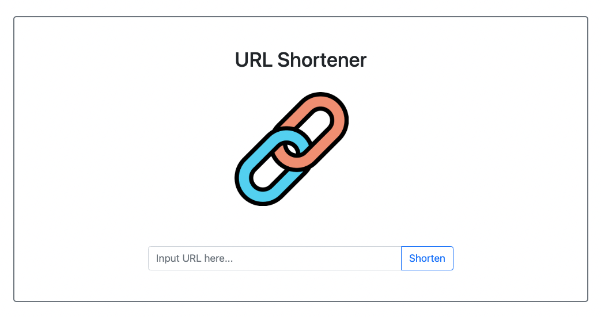

# URL_shortener


## 功能
- 將一般網址縮短
- 驗證網址是否存在
- 輸入相同網址或短網址得到同一短網址
- 可以一鍵copy
## 使用說明
1. 確認裝置裝有Node.js及npm
2. 將此專案從遠端clone到本地
3. 在terminal透過cd指令進入此專案資料夾
4. 載入專案所需之套件
```
npm install
```   
5. 準備自己的MongoDB database 自行新增.env檔 內容為
```
MONGODB_URI="你的URI字串"
```
6. 執行 
```
npm run start        //terminal上出現"running"以及"mongodb connected."後 可搜尋localhost:3000開始使用
```
8. 結束使用
```
ctrl + c
```
## 開發工具
- Node.js 18.12.0
- npm 8.19.2
- Express 4.18.2
- Epress-handlebars 7.0.7
- Bootstrap 5.1.3
- Mongoose 7.1.1
- Dotenv 16.0.3
- axios 1.4.0
- MongoDB Atlas 4.4.10
